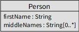
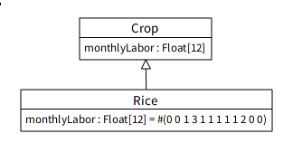
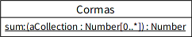
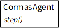
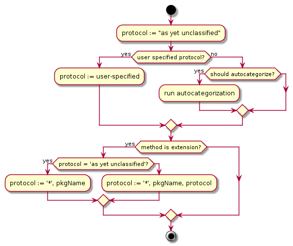
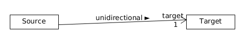
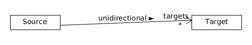
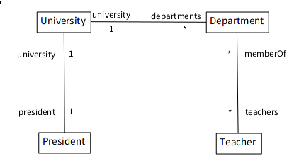

# Code Generation from UML model

## Overview

The code generation is done is several cycles:

1. For each class in the model
	1. Create a bare class
	2. Add attributes
	3. Add method templates
1. For each association in the model
	1. Create attributes
	2. Create methods


## Classes

For each `FAMIXClass` in the model a class in the system will be created.
The classes are topologically sorted, thus parent classes are created before child ones.

The model is always tied to one specified package, where all the classes will be created.

### Classes in different packages

If one of the classes in the model already exists in the system and is placed in a different package it will not be moved.
Furthermore, adding additional attributes to those classes is not permitted, however one can add methods to those classes. Such methods will be categorized as extensions.


## Attributes

Pharo has three types of attributes that we are concerned with [[UPBE](https://ci.inria.fr/pharo-contribution/job/UpdatedPharoByExample/lastSuccessfulBuild/artifact/book-result/PharoObjectModel/PharoObjectModel.html#sec:classVars)]:

1. instance variable — private to each instance
2. class variable (shared variable) — shared between the class that defines it, all it's subclasses and all instances of any of those classes
3. class instance variable — private to each class

> Note: Class variables (shared variables) are currently not supported.

For the rest, a variable is added to the appropriate side.


### Accessors

In addition, a user may want to generate accessors for the variables.
Because attributes in Pharo are always private, the UML visibility specification is meaningless and we can use it as a convenience to show, that user wants accessors.

By default, only regular accessors are generated, named after the variable; e.g. for variable `name`, a `#name` getter and `#name:` setter will be created.
Additionally the generator can be configured to create `#addX:` and `#removeX:` accessors for multivalued attributes (attributes with multiplicity > 1).

Finally, special pragma-based annotations containing all information necessary for reverse-engineering are added into getter method.

`<DCProperty: #propertyName type: #Type multiplicity: #(lower upper)>`.

`<DCProperty: 'propertyName : Type[lower..upper]'>`

Because this requires existence of getter, in situations where the attribute is private (no accessors are generated), a model description is used instead in a special class-side method.

```st
MyClass class>>attributeNameAttributeDescription
	<DCEntityDescription>
	^ DCAttributeDescription
		name: #attributeName;
		type: #Type;
		multiplicity: #(lower upper);
		visibility: #visibility; "#public or #private"
		yourself
```

For class-side variables, the method's name is `#attributeNameClassAttributeDescription`.

Example:



Generated code:

```st
"accessing protocol"
Person>>name
	<DCProperty: #name type: #String multiplicity: #(1 1)>
	^ name

"accessing"
Person>>name: aString
	name: aString

"accessing"
Person>>middleNames
	<DCProperty: #name type: #String multiplicity: #(0 *)>
	<DCProperty: #name: String[0..*]>
	^ middleNames

"accessing"
Person>>middleNames: aCollection
	^ middleNames: aCollection

"adding/removing"
Person>>addMiddleName: aString
	middleNames add: aString

"adding/removing"
Person>>removeMiddleName: aString
	middleNames remove: aString

"initialization"
Person>>initialize
	super initialize.
	middleNames = Set new
```


### Default value

Each attribute may have a default value. This value will be added to `#initialize` method of the class.
For collection attributes, if no default value is specified by the user, then an initial one is used instead.


Table 7.1. Collection types for MultiplicityElements [[section 7.5.3.2](www.omg.org/spec/UML/2.5/)]
| isOrdered | isUnique | Collection Type |
|--|--|--|
| false | true | Set |
| true  | true | OrderedSet |
| false | false | Bag |
| true | false | OrderedCollection |

The default configuration is `isOrdered = false` and `isUnique = true`, so `Set` is used. (See `#middleNames` attribute in previous section.)

#### Lazy initialization

The user can specify whether the default value should be defined in `#initialize` method or in a getter.

It is up to the user to decide what is the most appropriate choice: using `#initialize` may require more resources (memory), because the values are initialized whether they are needed or not, however one can safely refer from within the class to the instance variable without worrying about unitialized values.

Using lazy initialization on the other hand creates the value only when it is truly needed, however one should be careful about accessing the variable before it was initialized:

```st
Forager>>energy
	^ energy ifNil: [ energy := 50 ]

Forager>>consumeEnergy: amount
	energy := energy - amount

Forager new
	consumeEnergy: 20 "<-- error, energy wasn't initialized yet"
```

> Note: Class-side variables will always use lazy initialization.

#### Overriding variables



There may be a situation when overriding an attribute may be needed. The primary reason is to change it's default value.

In this scenario the algorithm will not add the variable again (since that would result in an error), however the subclass's initialize method will contain the new definition. Likewise accessors will not be added again.

?? maybe ??

If lazy initialization is done via accessor method, then the subclass will also have to specify it's default value in the subclassed method.


## Methods

Method generation provides basic scaffolding — method name and it's parameters.



```st
"unclassified"
Cormas class>>sum: aCollection
	<DCMethod: 'sum:(aCollection: Number[*]): Number'>
	"should be implemented"
```

```st
generator methodContent: '"should be implemented"'. "default"
generator methodContent: '^ self shouldBeImplemented'.

Cormas class>>sum: aCollection
	<DCMethod: 'sum:(aCollection: Number[*]): Number'>
	^ self shouldBeImplemented
```

Abstract methods cannot be customized in this way and will always contain `^self subclassResponsibility`.



```st
CormasAgent>>step
	<DCMethod: 'step()'>
	^ self subclassResponsibility
```

### Overriding methods

The generator is non-destructive, thus if there is already method defined it will not rewrite it or move it. However it may augment the method with a pragma annotation(s).

### Method categorization

The user has an option to specify the protocol from editable droplist, or let the system autocategorize it; if the method is part of a class extension, the protocol will be prefixed appropriately.



## Removing methods and attributes

Because removing methods, attributes or classes requires complex model diffing capabilities it is not supported and it is the user's responsibility to remove the appropriate code. However a simple tool can be creating that would give the user a list of methods and attributes, that are in the code but not in the model.

## Associations

Associations are by far the most complex part of the code generation. Navigability, referential integrity, etc. must be all considered.


### One-To-None and Many-To-None

One-To-None and Many-To-None are unidirectional associations.




I.e. only one side of the association will hold references.
This is functionally identical to having attributes.

> Note: If an endpoint is missing a role name it is treated as if it wasn't navigable to begin with.

Accessors for X-to-None are also the simplest case, since there is no need to update references of the other side.

```st
Source>>target
	<DCAssociation: 'Source --> target Target : unidirectional'>
	<DCAssociation: #target name: #'unidirectional >' multiplicity: #(1)>
	^ target

Source>>target: aTarget
	target := aTarget

Source>>targets
	<DCAssociation: 'Source --> target Target[*] : unidirectional'>
	<DCAssociation: #targets name: #'unidirectional >' multiplicity: #(1)>.
	^ targets

Source>>targets: aCollection
	targets := aCollection

Source>>initialize
	super initialize.
	targets := Set new
```

??Maybe??

Because one of the ends is not navigable it will be treated as attribute that doesn't have accessors.

The following description will be added to both sides of the association. For problems with naming conflicts see later section.

```st
Target class>>unidirectionalAssociationDescription
	<DCEntityDescription>
	<DCAssociation: 'Source --> "target" Target[1] : unidirectional >'>
	^ DCAssociationDescription
		name: #unidirectional;
		addEnd: [ :end |
			end
				name: #target;
				type: Target;
				multiplicity: #(1);
				navigable: true
		];
		addEnd: [ :end |
			end
				name: nil;
				target: Source;
				multiplicity: nil;
				navigable: false
		];
		yourself
```

### One-To-One, One-To-Many, Many-To-Many

In these scenarios a bi-directional reference needs to be maintained.

The getter will always take on the same form, while the setter will vary based on the relation.

```st
Class>>roleName
	<DCAssociation: associationSpecification>
	^ roleName
```




### One-To-One

```st
President>>university: aUniversity
	|oldRef|
	university = aUniversity ifTrue: [ ^ self ]. "prevent cycles"
	oldRef := university.
	university := aUniversity.
	oldRef ifNotNil: [ oldRef president: nil ].
	university ifNotNil: [ university president: self ].

University>>president: aPresident
	|oldRef|
	president = aPresident ifTrue: [ ^ self ]. "prevent cycles"
	oldRef := president.
	president := aPresident.
	oldRef ifNotNil: [ oldRef university: nil ].
	president ifNotNil: [ president university: self ].
```

### One-To-Many

For One-To-Many and Many-To-Many, in addition to regular setter additional `addX:` and `removeX:` methods will be created. The setter will then only delegate to them.

```st
University>>departments: aCollection
	"remove old departments"
	[ departments isNotEmpty ] whileTrue: [
		self removeDepartment: departments anyOne ].
	"add new ones"
	aCollection do: [ :each |
		self addDepartment: each ]

University>>addDepartment: aDepartment
	(departments includes: aDepartment) ifTrue: [ ^ self ].
	departments add: aDepartment.
	aDepartment university: self.

University>>removeDepartment: aDepartment
	(departments includes: aDepartment) ifFalse: [ ^ self ].
	departments remove: aDepartment.
	aDepartment university: nil.
```

```st
Department>>university: aUniversity
	|oldRef|
	oldRef := university.
	university := aUniversity.
	oldRef ifNotNil: [ oldRef removeDepartment: self ].
	university ifNotNil: [ university addDepartment: self ].
```

### Many-To-Many

Similar situation, except add/remove methods will call add/remove on the other side instead of setters.

```st
Department>>addTeacher: aTeacher
	(teachers includes: aTeacher) ifTrue: [ ^ self ].
	teachers add: aTeacher.
	aTeacher addMemberOf: self.

Department>>removeTeacher: aTeacher
	(teachers includes: aTeacher) ifTrue: [ ^ self ].
	teachers remove: aTeacher.
	aTeacher removeMemberOf: self.
```

`Teacher` side will be identical.

### Summary


|Relation|Side|Reference|
|-|-|-|
|One-To-One|President>>university:| <pre>university := aUniversity<br>aUniversity president: self</pre>|
|One-To-Many|University>>addDepartment:| <pre>departments add: aDepartment<br>aDepartment university: self</pre>|
|One-To-Many|Department>>university:| <pre>university := aUniversity<br>aUniversity addDepartment: self</pre>|
|Many-To-Many|Department>>addTeacher:|<pre>teachers add: aTeacher<br>aTeacher addMemberOf: self</pre>|

.
.
.
.


.

.

.

.


.

.


