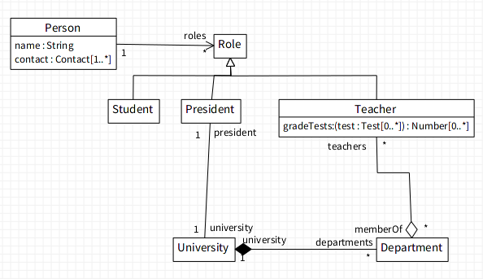

# Class Diagram DSL

A model of a class diagram can be created via textual notation.

Note however that not all features of UML are supported. This limitation is caused by lack of support of features in the underlying meta-model. The rule of thumb is, if it is not mentioned in this document, it is not supported.

```st
Person {
	name : String
	contact: Contact[1..*]
}

Teacher {
	gradeTests(test: Test[*]): Number[*]
}

Teacher extends Person;
Student << Person;
President << Person;

President president --- university University;
University[1] university <*>-- departments Department[*];
Department[*] memberOf <>-- teachers Teacher[*];
```

To parse the above text and open a diagram, run

```st
'Person {
	...
' asClassDiagram open
```
or
```st
(DCUmlDslParser parse: 'Person { ... ') open
```




## Class definition

Create an empty class `Class`:
```
Class { }
```

Create an empty class `SubClass` as a subclass of a `ParentClass`. If the parent class wasn't defined the model is ill-defined.

To add inheritance, use

```
<del>SubClass < ParentClass { }</del> "@todo"

SubClass << ParentClass;
"or"
SubClass extends ParentClass;
```

## Commonalities

### Visibility

Visibility is expressed by prefixing a line with a specific character.

* `+` — public
* `-` — private
* `#` — protected

### Multiplicity

Multiplicity is denoted with a `<lower-bound>..<upper-bound>` string.

* `<lower-bound>` is always a non-negative number,
* `<upper-bound>` is a non-negative number, or a star `*` representing unlimited upper bound.

Furthermore if both bounds are equal, or the lower bound is `0` and upper bound `*`, then the lower bound can be ommited.

Examples:

|full range|shortcut|
|-|-|
|0..1||
|10..10|10|
|0..\*|\*|

> Designators (`isUnique` and `isOrdered`) are not supported.

### Abstract and Static

To specify an element as abstract, prefix it's name with slash `/`.

```st
/AbstractClass {}

/abstractMethod(Type param) : nil
```

Static elements are prefixed with underscore `_`.


```st
_staticMethod()
_classVariable
```

When combined, the order doesn't matter.

```st
_/staticAbstract()
/_abstractStatic()
```


## Attributes

```st
<property-name> : [<Type>[<multiplicity>]] [ = <defaultValue>]
```

The only mandatory segment is `<property-name>`, however adding multiplicity also implies type.

Examples:

```st
id "default type Object"
name : String "default multiplicity 1..1"
middleNames : String[*] "deafult type nil"
_workDays_ : String[5] = #(Monday Tuesday Wednesday Thursday Friday)
```

> Property modifiers are not supported.

## Methods (Operations)

Only name and parentheses are required.

Note that operations describing Pharo methods should be named accordingly (with colons).

```st
<operation> ::= <name>'('[<parameters>]')'[ ':' <returnType>[<multiplicity>]]
<parameters> ::= <parameter>[ ',' <parameter> ]*
<parameter> ::= <name>[':'<Type>[<multiplicity>]]
```

Examples:

```st
function()
inject:into:(aValue, aCollection)
add:afterIndex:(anObject : Object, anIndex: Integer) : Object
reject:(rejectBlock : BlockClosure[1]) : Object[*]
```

## Associations

Only simple binary associations are supported.

```
SourceClass[range] "sourceName" --- "targetName" TargetClass[range] : "association name";
```

All names and both multiplicity ranges are optional. To use aggregation or composition, or explicitly define a navigable end point use the appropriate symbols as shown.

```
Class[0..1] "class" --- "operations" Operation[*]; "association"
Community[*] "memberships" <>-- "members" Person[*]; "aggregation"
University[1] university <*>-- departments Department[*]; "composition"
Order[*] --> "products" Product[1..*]; "navigable in a single directon"
```
