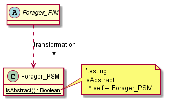
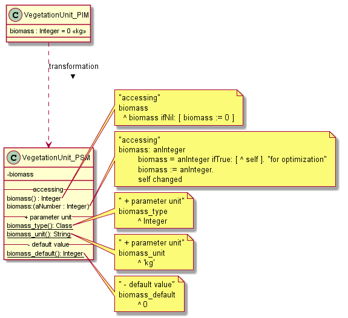
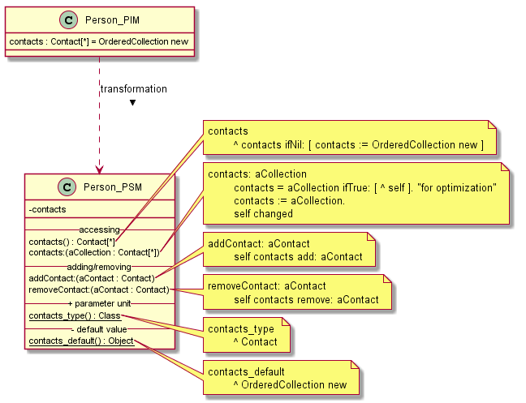
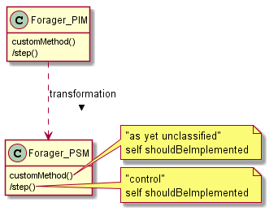

# PIM to PSM

PIM to PSM transformation specific to CORMAS context and targetting VW.

The PSM must be precise enough to be directly compilable to code.

The implementation is in the `Uml-CodeGenerator` package (and `VW-Generators` tag).

## Usage - Transformation

Class `UCMVWPimToPsmTransformer` is responsible for transforming PIM into VW-compatible PSM.

The following example creates a new PIM model, transforms into PSM and opens in OpenPonk Workbench.
The details of this particular transformation are in the *Attribute expansion* section.

```st
| pim psm |
pim := 'VegetationUnit {
biomass : Integer = 0
}' asClassDiagram.
pim name: 'Model'.
pim allClasses first attributes first unit: 'kg'.
pim allClasses first name: 'VegetationUnit (PIM)'.
psm := UCMVWPimToPsmTransformer new generateFor: pim with: nil.
psm allClasses first name: 'VegetationUnit (PSM)'.
DCProject new
  addModel: psm;
  addModel: pim;
  open
```

## Usage - Code generation

The class `UCMVWXmlExporter` performs the code generation from PSM in the form of XML file that can be imported into VW.

Example:

```st
| pim psm writer |
pim := '
MyPSM <<CormasModel>> {
}
VegetationUnit <<Entity>> {
	biomass : Integer = 0
}' asClassDiagram.
pim name: 'Model'.
pim allClasses second attributes first unit: 'kg'.

psm := UCMVWPimToPsmTransformer new generateFor: pim with: nil.

writer := UCMVWXmlExporter new.

'/path/to/file.xml.st' asFileReference
	ensureDelete;
	writeStreamDo: [ :stream |
		stream nextPutAll: (writer writeModel: psm).
	].
```

## Abstract class

Smalltalk has no abstract classes, instead class-side `isAbstract` method is used.

Test for abstract class is always against the class itself (instead of returning `true`/`false`), that way there is no need for extra tests in the subclasses.



## Attribute expansion

An attribute is expanded as follows:



* Smalltalk has no concept of default value, so getter is used instead
  * an alternative is to use `#initialize`, however that is not used in Cormas
* attributes are always private
* setter has perf optimization
* type metadata is stored in class-side methods
* all generated methods should contain a `"generated code"` comment.

### Collection attribute expansion

Collection attribute has slightly different code, and `addX:` and `removeX:` methods are added.



## Method expansion



* (TODO implementation) parameters
* (TODO implementation) if the category can be inferred on Pharo side (from Pharo's CORMAS model) it will be used

## Association expansion

TODO docs

the association generation is based on the previous Pharo code generation described here https://github.com/OpenPonk/class-editor/blob/master/docs/code-generation/uml-to-code.md

but some modifications (namely `#forgetAttribute:`) were added.
